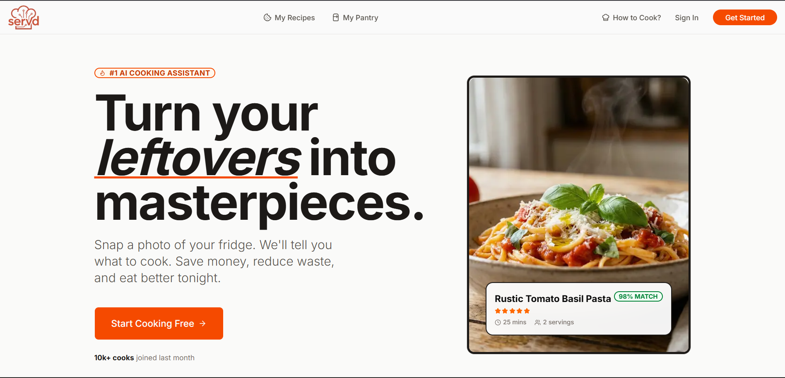
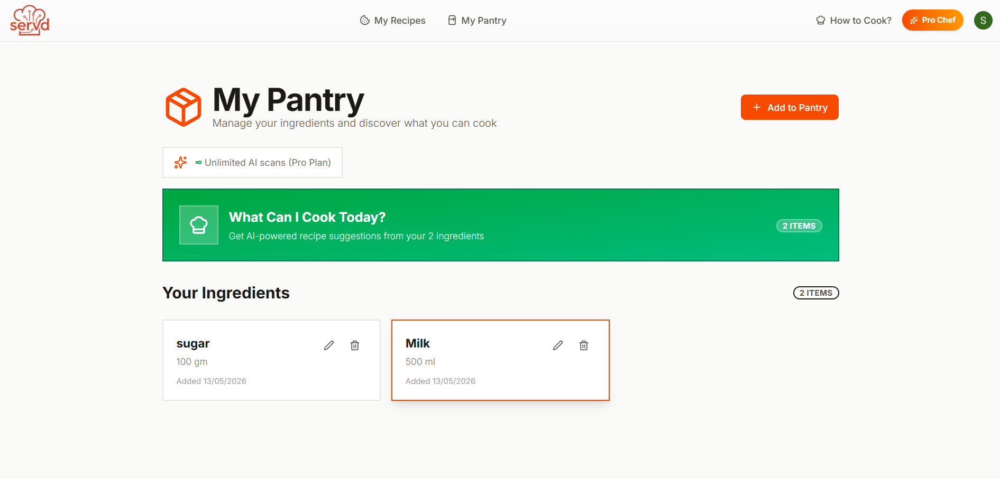
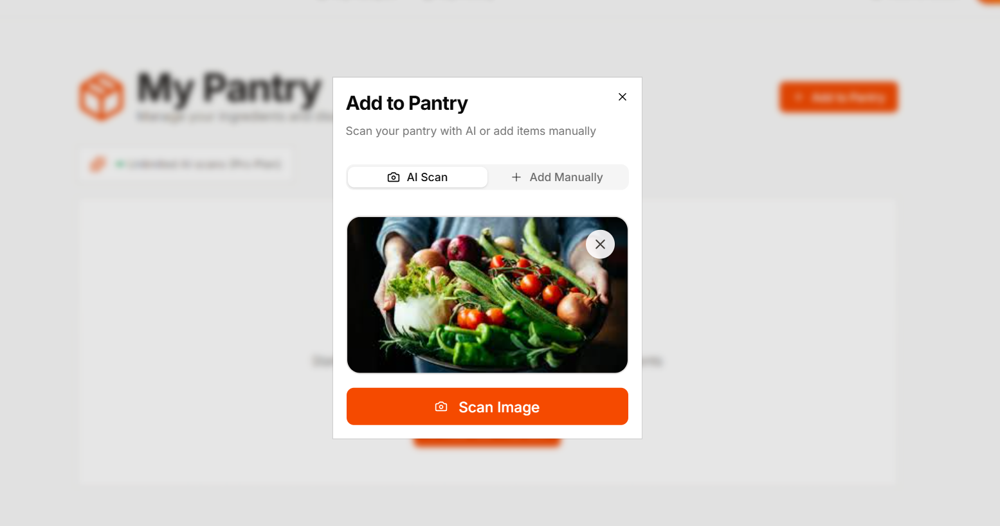
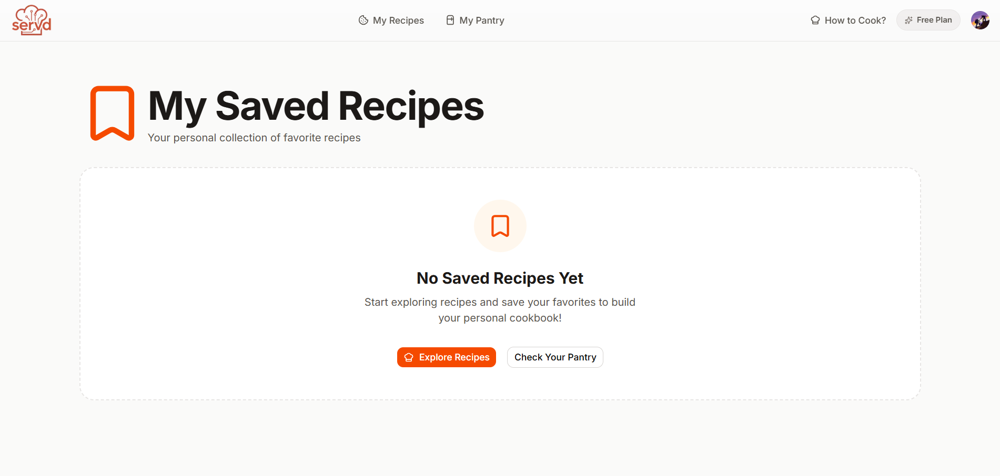
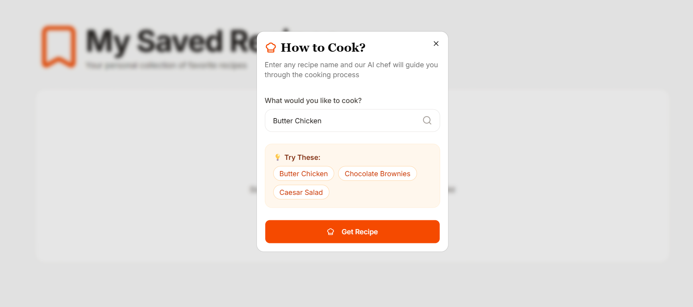
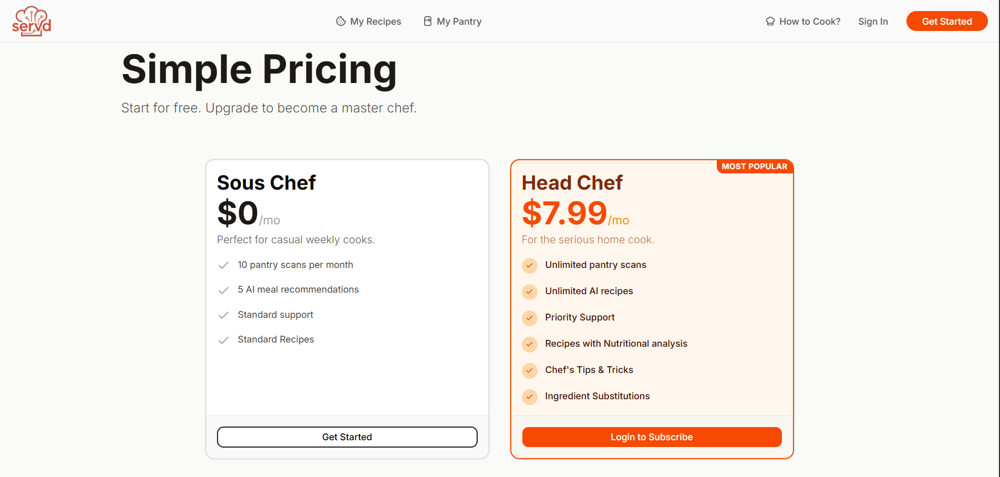

# Servd

Servd is a smart cooking companion that turns pantry items into recipes, generates step-by-step instructions with AI, and lets users save, manage, and revisit their favorites. It combines a Next.js frontend with a Strapi backend and Clerk authentication.

## Screenshots

### Home


### My Pantry


### Add to Pantry


### My Recipes


### AI Cook


### Pricing


### Footer


## Features

- AI pantry scan from images and manual pantry entry
- Pantry-based recipe recommendations
- AI recipe generation with step-by-step instructions
- Recipe details with ingredients, cooking tips, and nutrition
- Save, unsave, and manage favorite recipes
- Recipe images fetched from Unsplash
- Pro plan gating for premium features (nutrition, unlimited AI)
- PDF recipe export
- Authentication and billing with Clerk
- Strapi-backed APIs for pantry items, recipes, and saved recipes

## Tech Stack

- Frontend: Next.js 16, React 19, Tailwind CSS, Base UI
- Backend: Strapi 5
- Auth/Billing: Clerk
- AI: Google Gemini API
- Media: Unsplash API

## Architecture

- `frontend/` contains the Next.js app (App Router)
- `backend/` contains the Strapi API
- The frontend calls the Strapi API for pantry, recipes, and user data
- AI generation is handled server-side in Next.js actions

## Getting Started

### 1) Install dependencies

```bash
cd frontend
npm install

cd ../backend
npm install
```

### 2) Configure environment variables

Create `.env` files in each app based on your setup.

Frontend (examples):
- `NEXT_PUBLIC_STRAPI_URL`
- `STRAPI_API_TOKEN`
- `CLERK_SECRET_KEY`
- `NEXT_PUBLIC_CLERK_PUBLISHABLE_KEY`
- `GEMINI_API_KEY`
- `UNSPLASH_ACCESS_KEY`

Backend (examples):
- `DATABASE_URL`
- `APP_KEYS`
- `API_TOKEN_SALT`
- `ADMIN_JWT_SECRET`
- `JWT_SECRET`

### 3) Run the apps

```bash
# frontend
cd frontend
npm run dev

# backend
cd backend
npm run develop
```

## Scripts

Frontend:
- `npm run dev`
- `npm run build`
- `npm run start`
- `npm run lint`

Backend:
- `npm run develop`
- `npm run build`
- `npm run start`
- `npm run deploy`

## Deployment Notes

- Deploy the frontend to Vercel (project root: `frontend`).
- Deploy the backend to a Strapi-compatible host.
- Ensure all required environment variables are configured in production.


## License

This project is provided as-is for educational and portfolio use.
